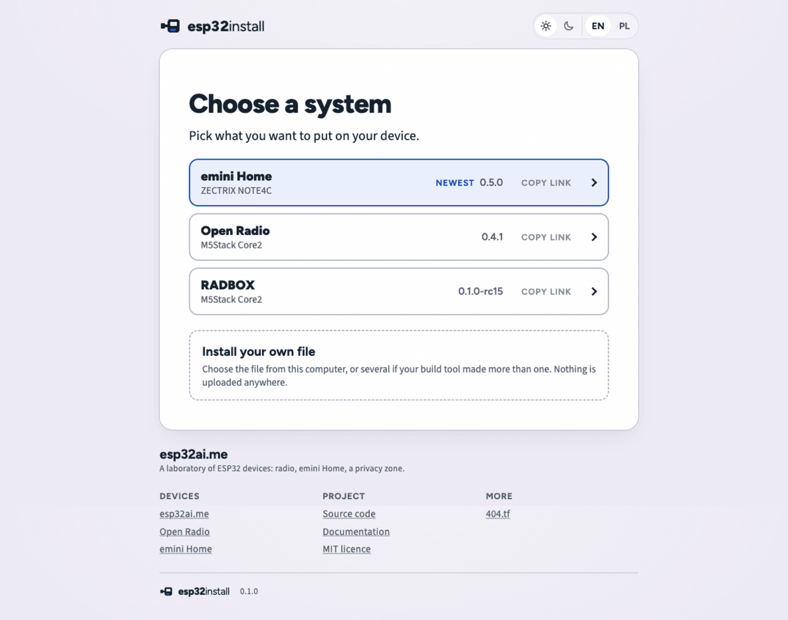
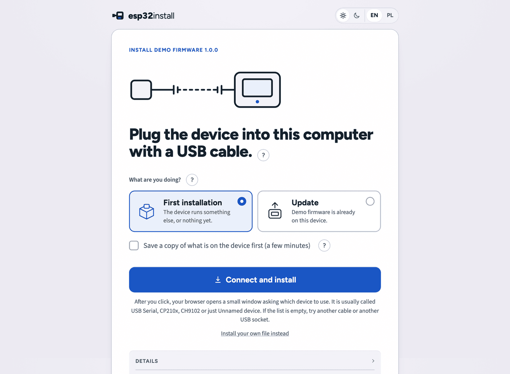

# esp32install

<p align="center">
  
</p>

<p align="center">
  <em>A configured copy, live at <a href="https://esp32ai.me/install">esp32ai.me/install</a>:
  three systems, each with its board and the version it would install.</em>
</p>

[](https://github.com/fiedoruk/esp32install/actions/workflows/tests.yml)
&nbsp;MIT licence &nbsp;·&nbsp; no dependencies, no build step

**Install ESP32 firmware from a web page, over a USB cable.** One directory of
static files. Copy it to any server that serves HTTPS and it works — no build
step, no bundler, no CDN, no account.

It reads the [esp-web-tools](https://github.com/esphome/esp-web-tools) manifest
format unchanged, so a release you already publish works here as it is. It also
takes a file straight off your disk — the three or four files a PlatformIO build
leaves behind, each at its own address — for the times you have a binary and no
manifest at all.

Before it writes a byte it checks the checksum, the layout, the flash size the
chip reports, and the chip id inside the image. If any of those disagree, it
stops and says which one.

**[Try it →](https://esp32ai.me/install)** · Chrome, Edge, Opera or
Firefox 151 or newer, on a computer.

Three words this page uses throughout: a **manifest** is one JSON file describing
one release — its name, the boards it fits, and which file goes at which address.
A **part** is one of those files at one of those addresses. A **profile** is how a
release chooses to install itself: `factory` may erase the chip first, `preserve`
never does.

## Try it in one minute

1. Open <https://esp32ai.me/install> in Chrome, Edge, Opera or
   Firefox 151 or newer, on a desktop computer. Web Serial does not exist on
   Safari, and no phone browser has it.
2. Plug an ESP32 board into a USB port.
3. Pick a system from the list, or choose *Install your own file* and point it at
   a `.bin` you built yourself.
4. Press **Connect and install**, then pick the port in the browser's own dialog.

<p align="center">
  
</p>

<p align="center">
  <em>What a link to one release opens on — here the demo release that ships with
  this repository. The same screen in the dark theme:
  <a href="docs/img/prepare-dark.png">prepare-dark.png</a>.</em>
</p>

Nothing is uploaded anywhere. The bytes go from your disk, or from the server that
serves the page, straight down the cable.

The page tests for the Web Serial API rather than for a browser name, so a browser
that gains it later works without a change here. It also has to be served over
**HTTPS**, or opened from `localhost`.

On a browser without Web Serial the page still loads and still says what the
release is. The install button is replaced by a sentence saying why, the panel of
technical facts is hidden, and the ready-made `esptool` command line with the
files and their checksums stays on the page under *Other ways to install*, folded
shut. On a phone the page offers to copy or share the link instead, so it can be
opened on a computer. On a page served over plain `http:` the sentence is a
different one and that same section is open, because there the `esptool` route is
the next thing worth reading.

## What it checks before it writes

Every one of these is a hard stop. Some are checked before the device is opened
at all; the rest need the chip to answer first. Nothing is written until all of
them have passed.

- **Where the files may come from.** Every part URL must resolve to the origin
  that served the manifest, or to one the site listed in `allowOrigins`, over
  `http:` or `https:` only. Redirects are followed, but the response that finally
  delivers the bytes has to be on the origin that was requested.
- **Size.** A part that declares `size` must arrive with exactly that many bytes.
  No empty part, 32 MiB per part, 64 MiB in total.
- **Checksum.** A part that declares `sha256` must hash to it. A part that
  declares none is hashed anyway and the hash goes into the log.
- **Layout.** No part may reach past the end of the flash the chip reported, and
  no two parts may overlap.
- **Flash size.** Read from the JEDEC id the chip returns. An unreadable or
  unknown id stops the install; there is no silent fallback to 4 MB.
- **The right chip.** Whatever covers the chip's bootloader offset must start
  with the ESP image magic `0xE9` and carry this chip family's image id, and so
  must every other part that starts with `0xE9`.
- **The right build.** A build is offered only if the chip family, flash size,
  USB ids, chip-description substrings and feature strings it declares match the
  hardware that is plugged in.

Both profiles also ask the chip whether secure boot or flash encryption is on,
before anything is erased or written, because the plaintext this installer sends
would leave such a board unable to start. They differ only in what an unreadable
answer means: `factory` goes ahead and says so in the log, `preserve` refuses to
write on a guess. A file chosen from disk has no origin and is never fetched;
every other check above runs on it unchanged.

The threat model, what is checked after writing, and what this cannot verify at
all: [docs/security.md](docs/security.md).

## Put your own firmware behind it

The picture at the top is what a configured copy looks like. Three systems, each
with the board it fits and the version it would install: emini Home for a ZECTRIX
NOTE4C, Open Radio and RADBOX for an M5Stack Core2. The first row is tinted and
tagged *Newest* because it is the first system in the file **and** the release it
would install is a stable one — a test build is never the strongest thing on the
screen. Each row carries *Copy link*, which puts a link straight to that system on
the clipboard, for whoever is writing the page that sends people here.

All of that comes out of one file. This is the entry that draws the highlighted
row:

```json
{ "id": "emini-home", "name": "emini Home", "device": "ZECTRIX NOTE4C",
  "releases": [ { "version": "0.5.0", "manifest": "firmware/emini-home-0-5-0.json", "channel": "stable" } ] }
```

`name` and `device` are the two lines of the row. `version` is the tag on the
right. `id` and `manifest` are yours to name: the id is what a link means by
`?fw=emini-home`, and the manifest is a path on your own site. Add older releases
to `releases`, newest first — the page keeps your order and does not parse
version numbers — and a visitor with no `?v=` in their link gets the newest
stable one.

Every field, including `allowOrigins`, `guide` and the channel rules:
[docs/manifest.md](docs/manifest.md#catalogjson).

## Replicate in three steps

**1. Copy the site.** Put the contents of this repository on any static host that
serves HTTPS. There is nothing to compile.

```
rsync -a --exclude '.git' --exclude 'tests' --exclude 'docs' --exclude '__pycache__' ./ /var/www/install/
```

That is about 1.1 MB, of which roughly 875 KB is what a browser actually loads:
mostly the vendored esptool-js bundle and the fonts. `tests/`, `tools/` and
`docs/` are not needed on the server; leaving `tools/` there is harmless and
handy, because `check.py` then runs from the same machine.

**2. Write a manifest for your firmware.** Put the binaries next to the manifest
and let the tool measure sizes and checksums. Give the output a name of your own;
the shipped `firmware/demo-1-0-0.json` is the schema 1 example and is best left
as it is:

```
python3 tools/manifest.py firmware/demo.bin@0x1000 \
  --chip ESP32 --name "Demo firmware" --version 1.0.0 \
  --prompt-erase --out firmware/my-firmware-1-0-0.json
```

```
wrote firmware/my-firmware-1-0-0.json: Demo firmware 1.0.0, 1 part, 4096 bytes
```

`--help` lists every option, including `--profile preserve` and the compatibility
regions that profile needs. See [docs/manifest.md](docs/manifest.md).

**3. List the release and check the result.** The shipped `catalog.json` lists
no systems, so until this step a copy opens on the own-file path and offers
nothing of its own. Add your release:

```json
{ "site": "example", "systems": [ { "id": "my-firmware", "name": "My firmware", "device": "Any ESP32 board",
  "releases": [ { "version": "1.0.0", "manifest": "firmware/my-firmware-1-0-0.json", "channel": "stable" } ] } ] }
```

Then ask the tool whether everything the page will fetch is really there. It
takes a directory, so you can run it before you upload:

```
python3 tools/check.py .
```

```
OK csp index.html pins default-src to 'self'
OK vendor esptool-js-0.6.1.js matches the pinned checksum
OK vendor serial.js matches the pinned checksum
OK vendor const.js matches the pinned checksum
OK vendor util/hex-formatter.js matches the pinned checksum
OK vendor util/to-hex.js matches the pinned checksum
OK vendor LICENSE matches the pinned checksum
OK catalog catalog.json lists 1 system
OK size build-1: demo.bin is 4096 bytes
OK sha256 build-1: demo.bin
OK layout build-1: 1 part, no overlap
OK chip build-1: demo.bin is an ESP32 image
SUMMARY 12 OK, 0 WARN, 0 FAIL
```

Run it again as `python3 tools/check.py https://example.com/install/` once the
files are up: given a URL it also reads the response headers and warns when the
host sends neither `X-Frame-Options` nor a `frame-ancestors` policy, which a page
cannot set for itself. It exits 0 when nothing failed, 1 on any FAIL, 2 when the
command was wrong.

Full walkthrough for Apache, nginx, GitHub Pages and other hosts:
[docs/replicate.md](docs/replicate.md).

## Install a file of your own

Open the page with `?own=1`, or follow *Install your own file* from the list.
Choose a `.bin` from your disk, or paste the address of one (a path on the same
site, such as `/firmware/my-app-1-0-0.bin`, or a full URL) and press *Read it*.
Nothing is uploaded: the bytes are read in the browser and go through the same
checks as a catalogued release.

A PlatformIO or Arduino build leaves three or four files, not one. *Add another
file* opens a row per file, up to six. The page reads each header and suggests
the address a build tool would have used, and every suggestion stays editable.
An address has to be hex on a 4 KiB boundary; anything else is shown as a bad
address rather than guessed at. One file works too, if `esptool merge_bin` glued
the build into a merged image.

An address on another site is usually refused, by the page's own
`connect-src 'self'` or by that site's CORS headers; the page says so and
suggests downloading the file and choosing it from disk.

Addresses, per-chip offsets and the rules in full:
[docs/manifest.md](docs/manifest.md#files-from-a-build-tool).

## Manifests it reads

**Schema 1 is the esp-web-tools manifest**, key for key, so a release you already
publish installs here as it is. **Schema 2** is a superset: the same file plus the
fields the extra checks and the `preserve` profile need. A file with no `schema`
key is read as schema 1.

One difference worth knowing before you publish: a part with no `sha256` still
installs, and its hash is printed in the log, but `tools/check.py` reports such a
manifest as a failure rather than a warning, because nothing on the page can
compare a hash against a claim that was never made.

Every field, both example manifests and the `catalog.json` format:
[docs/manifest.md](docs/manifest.md).

## Supported chips

Taken from the table in `app/verify.js`, measured against esptool-js 0.6.1.
`tools/manifest.py --chip` takes either spelling: the family name in the first
column, or the esptool one in the second (`esp32s3` is the same as `ESP32-S3`).
The manifest always carries the first-column name.

| Chip family | esptool `--chip` | Bootloader offset | Image chip id |
|---|---|---|---|
| ESP8266 | `esp8266` | `0x0` | none — magic byte only |
| ESP32 | `esp32` | `0x1000` | 0 |
| ESP32-S2 | `esp32s2` | `0x1000` | 2 |
| ESP32-S3 | `esp32s3` | `0x0` | 9 |
| ESP32-C2 | `esp32c2` | `0x0` | 12 |
| ESP32-C3 | `esp32c3` | `0x0` | 5 |
| ESP32-C5 | `esp32c5` | `0x2000` | 23 |
| ESP32-C6 | `esp32c6` | `0x0` | 13 |
| ESP32-C61 | `esp32c61` | not declared by the library | 20 — not checked |
| ESP32-H2 | `esp32h2` | `0x0` | 16 |
| ESP32-P4 | `esp32p4` | `0x2000` | 18 |

Two caveats: an **ESP8266** image carries no chip id field, so only the `0xE9`
magic byte is checked on it, and **ESP32-C61** is the one family esptool-js 0.6.1
gives no bootloader offset for, so the check at that offset is skipped there.
Parts that start with `0xE9` are still held to the C61 image id.

## After the install

Two things follow a successful install and neither can fail it. The page reopens
the port and asks whether the device speaks
[Improv Serial](https://www.improv-wifi.com/serial/); if it does, the done screen
offers one optional step to send it a Wi-Fi network and password over the cable.
And inside the technical log, *Show what the device says* streams the device's own
output at 115200 baud, on the done screen and on the stopped screen alike, so a
failed boot can be read without another tool.

## The two profiles

**`factory`** is the default and behaves like a classic flasher: verify every
part, optionally offer to erase the whole chip first, write everything in one go.

**`preserve`** is for a device that already works and whose user data has to
stay. It never erases, writes only the parts the manifest lists, refuses to start
unless the existing flash matches what the manifest says it should be, and takes
a whole-flash backup it reads back from disk before the first write.

Step by step, with every stop condition and every message the page can show:
[docs/profiles.md](docs/profiles.md).

## Third-party code in the bundle

Three things are vendored rather than fetched from a CDN: esptool-js 0.6.1
(Apache-2.0, with pako 2.1.0 embedded for deflate), the headless protocol client
from improv-wifi-serial-sdk 2.8.1 (Apache-2.0), and three font families under the
SIL Open Font License 1.1. Every file's SHA-256 is pinned in a `SHA256SUMS` next
to it and checked by `tools/check.py` on every run.

Versions, licences, checksums and the three-byte change to two Improv import
specifiers: [THIRD-PARTY-NOTICES.md](THIRD-PARTY-NOTICES.md).

## Running the tests

```
node --test
python3 -m unittest discover -s tools/tests -t .
```

The first runs the browser-side suite against a fake esptool, so no hardware is
needed. The second runs the Python tools' suite. Both are expected to pass with
no failures. Node 20 or newer and Python 3.9 or newer; nothing else is required,
and there is nothing to install first.

## Security

The threat model, what the installer can and cannot verify, and the reasoning
behind the Content-Security-Policy are in [docs/security.md](docs/security.md).
To report a vulnerability, see [SECURITY.md](SECURITY.md).

## Contributing

Open an issue describing the device or the release format before writing code, so
the manifest schema stays one schema.

Every change needs both test suites green, and a change to `app/` or `tools/`
needs a test that fails without it.

Keep the product free of local paths, private addresses and anything specific to
one publisher's site; the demo site is an example, not a dependency.

## Who made this

Tomasz Fiedoruk. It came out of needing an install page for my own ESP32 devices,
and not wanting to hand a stranger's CDN the code that writes to someone's flash.
It is maintained in spare time, by one person. [SECURITY.md](SECURITY.md) says
honestly what that means if you find a bug.

## Licence

MIT. See [LICENSE](LICENSE).

Not affiliated with, endorsed by, or supported by Espressif Systems. "ESP32" and
"ESP8266" are used only to name the hardware this tool writes to.
